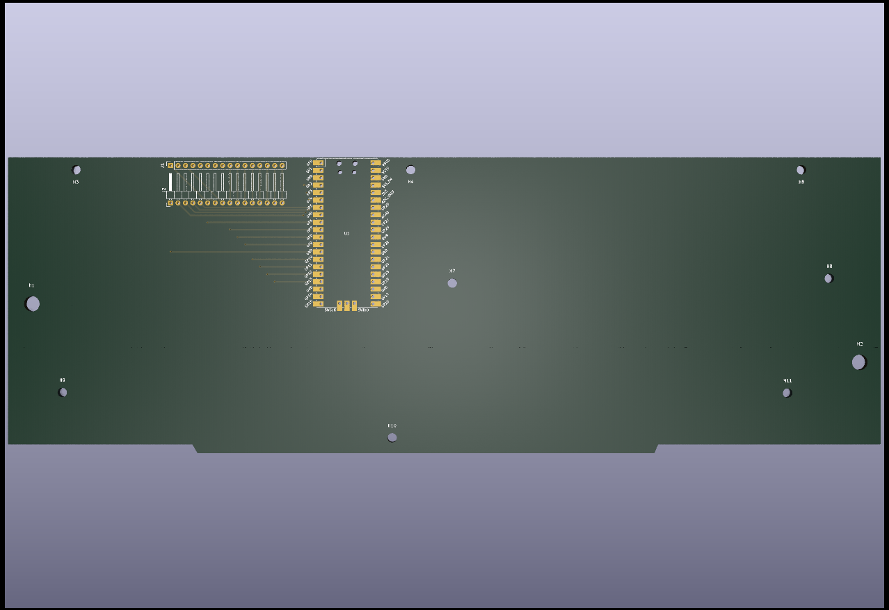

# Reproduction Keyboard for Dragon 32 and 64 #

This project provides the design for a reproduction keyboard
to fit the Dragon 32 and 64 home computers. The design here is
a complement to the main keyboard PCB. This provides mounting
points to the case and additional wiring to convert the board
to the CoCo connector

The conversion works by letting the top board plugin vertically
while letting the CoCo connector plugin underneath horizontally

## Future Plans ##

To further increase functionality the plan is to add support to
make the keyboard HID compliant by the addition of a cheap 
microcontroller board such as an arduino or a pico
